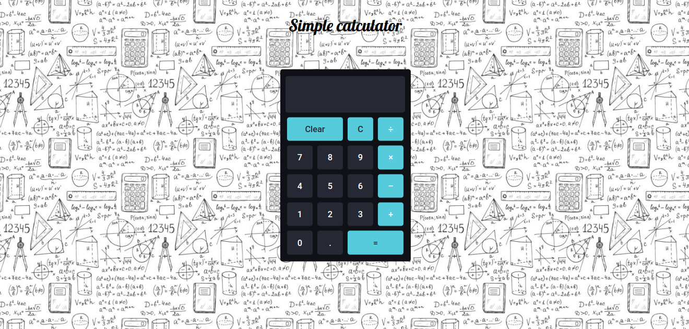
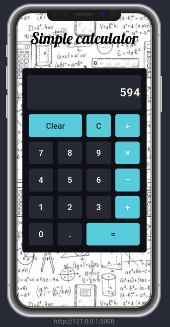

# Sobre o projeto

Este é um projeto que consiste em uma simple calculadora feita em reactjs e estilizada com css puro.

## Layout para Web



## Layout para Mobile



## Como rodar este projeto

Para clonar e executar este aplicativo, você precisará de Git, NodeJs Instalado em seu computador.

## Clonando o repositório

```
# Clone este repositório
$ git clone https://github.com/nfescame/calculator.git

# Acesse a pasta do projeto no terminal/cmd
$ cd calculator
```

## Rodando a aplicação web

```
# Instale as dependências
$ npm install

# Execute a Aplicação
$ npm start

# O servidor inciará na porta:3000 - acesse http://localhost:3000
```
